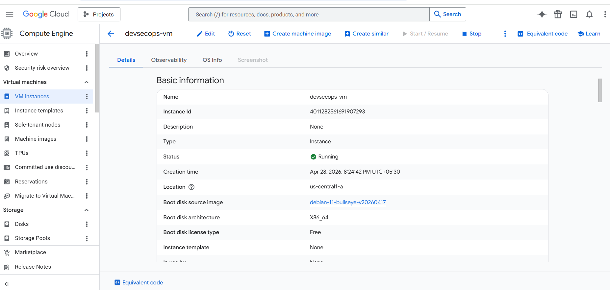
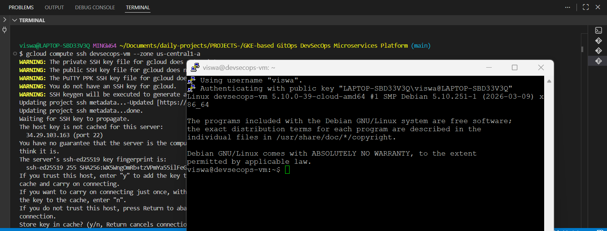
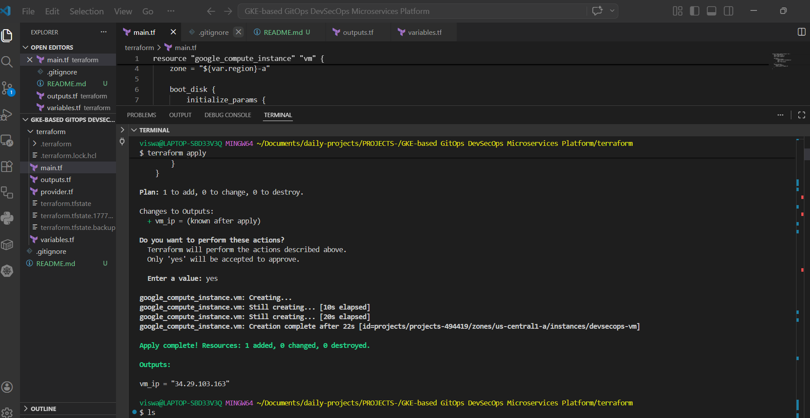

#DevSecops platform project:

##Phase -1 Infrastructure (Terraform + GCP)

This project is a part of "Production level DevSecOps Platform" where I built a complete CI/CD+GitOps+Kubernetes ecosystem

##In Phase-1 - I focussed on :
*Infrastructure provisioning using Terraform
*Deploying VM on Google cloud
*Preparing the base environment for automation ( Ansible, Docker, Kubernetes in later phases)

##ARCHITECTURE: PHASE-1
User -> Terrafrom -> GCP -> Vm (Compute Engine)

## 🧰 Tech Stack

| Tool        | Purpose |
|------------|--------|
| Terraform  | Infrastructure as Code (IaC) |
| GCP        | Cloud provider |
| Compute Engine | Virtual Machine hosting |
| GitHub     | Version control |

---

## 📁 Project Structure
terraform/
├── main.tf # Defines VM infrastructure
├── variables.tf # Input variables (project_id, region)
├── outputs.tf # Outputs like VM public IP


---

## ⚙️ Terraform Configuration Explained

### 🔹 main.tf

- Creates a **GCP Virtual Machine**
- Uses **e2-micro (free tier eligible)**
- Installs **Debian OS**
- Assigns **public IP for SSH access**

```hcl
resource "google_compute_instance" "vm" {
    boot_disk {
  initialize_params {
    image = "debian-cloud/debian-11"
  }
}
- Defines OS image for the VM
- Debian is lightweight and widely used in servers

🔹 network_interface
network_interface {
  network = "default"
  access_config {}
}

- Enables public internet access
- Required to SSH into the VM

🔹 metadata (SSH Key)
metadata = {
  ssh-keys = "viswa:${file("teja_pub.pub")}"
}

- Injects SSH public key into VM
- Allows secure login without password

🔐 Security Considerations
SSH key-based authentication (no passwords)
Minimal open ports
Lightweight VM to reduce attack surface

------------------

🚀 How to Run
1. Initialize Terraform
terraform init
2. Plan Infrastructure
terraform plan

👉 Shows what resources will be created

3. Apply Configuration
terraform apply

👉 Creates the VM on GCP

4. Connect to VM
gcloud compute ssh devsecops-vm --zone us-central1-a
📤 Outputs
output "vm_ip" {
  value = google_compute_instance.vm.network_interface[0].access_config[0].nat_ip
}

👉 Displays public IP of VM after deployment

💰 Cost Optimization
Uses e2-micro (free tier eligible)
Uses pd-standard disk (cheap storage)
Avoids managed Kubernetes (cost-heavy)

##Screenshots

![Terraform] (Screenshots/Terraform-Apply-complete.png)







📊 What This Phase Achieves

✔ Infrastructure as Code
✔ Cloud provisioning automation
✔ Secure VM access
✔ Foundation for DevOps pipeline

🔜 Next Phases
Phase 2: Ansible Automation (Docker + k3s setup)
Phase 3: Kubernetes deployment (microservices)
Phase 4: CI/CD with GitHub Actions
Phase 5: Monitoring (Prometheus + Grafana)
Phase 6: GitOps (ArgoCD + Helm)
👨‍💻 Author

Viswa
DevOps Engineer | Cloud | Kubernetes | Automation